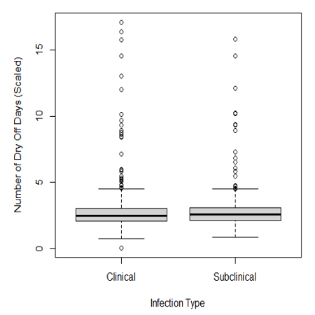
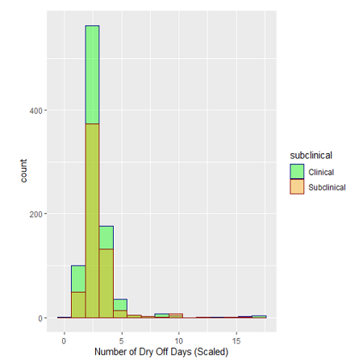
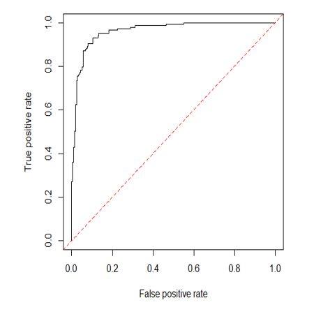

<div class="ui medium rounded images">
  
  
  
</div>

What factors or farm practices affect the susceptibility of dairy cows to sub-clinical vs clinical mastitis?
My thesis was part of a wider collaborative project between University College Dublin and Teagasc (Irish Agriculture and Food Development Authority). Mastitis is an illness effecting the udders in dairy cattle. It can appear as both clinical and subclinical. Subclinical cases are undetectable by traditional methods which can cause it to exist untreated in a herd for long periods of time, negatively impacting the herds output and the effected animal’s welfare. My research aimed on determining what factors affect a cow having clinical versus subclinical mastitis

For this project, I was the lead programmer who was responsible for programming the various capabilities of the mouse.  I started by programming the basics, such as sensor polling and motor actuation using interrupts.  From there, I then programmed the basic PD controls for the motors of the mouse.  The PD control the drive so that the mouse would stay centered while traversing the maze and keep the mouse driving straight.  I also programmed basic algorithms used to solve the maze such as a right wall hugger and a left wall hugger algorithm.  From there I worked on a flood-fill algorithm to help the mouse track where it is in the maze, and to map the route it takes.  We finished with the fastest mouse who finished the maze within our college.

Here is some code that illustrates how we read values from the line sensors:

```js
byte ADCRead(byte ch)
{
    word value;
    ADC1SC1 = ch;
    while (ADC1SC1_COCO != 1)
    {   // wait until ADC conversion is completed   
    }
    return ADC1RL;  // lower 8-bit value out of 10-bit data from the ADC
}
```

You can learn more at the [UH Micromouse Website](http://www-ee.eng.hawaii.edu/~mmouse/about.html).


