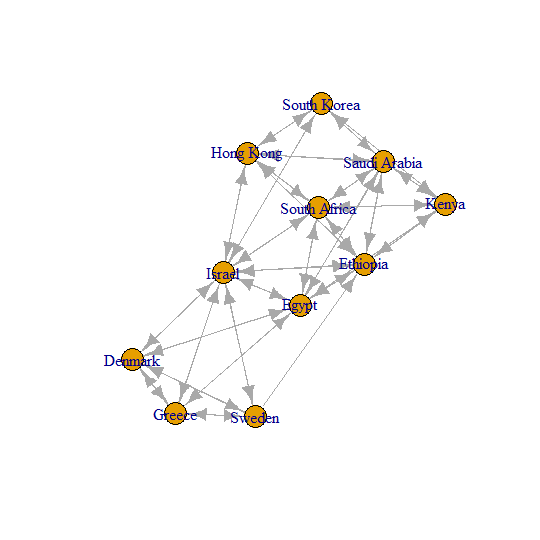

In this project I tried to gain some insights on the topology of the transportation infrastructure that people use to move around the world while also familiarising myself on working with statistical networks in R through the use of igraph and other packages like blockmodels. This topic was particularly relevant at the time of the study as it was carried out  in light of the spread of the pandemic Covid-19. This study looked at the connectivity of 225 'countries' (Disconnected landmasses such as Jersey and the Isle of Man were considered as an independent country).

I carried out a number of assessments such as determining which nodes (countries) were the most central, and does this centrality differ depending on the method used (Page rank versus betweenness)? I also created clusters of the network to see if the connectivity is related to geographical closeness. I was able to find that when using a stochastic blockmodel with 8 groups, these groups reflect quite distinct geographic areas. Finally, I was able to show that our global airport network is quite resistant to random point attacks - that is, if random countries shut down their airports, the overall connectivity of the world is not heavily impacted. Even if the most connected countries are attacked, it takes a large number to be shut down before overall connectivity is significantly impacted.

Please feel free to contact me to ask any further information, you can view the full [RMarkdown pdf of the project here ](https://seanmc64.github.io/flights1.pdf)

