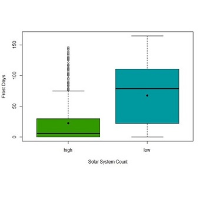
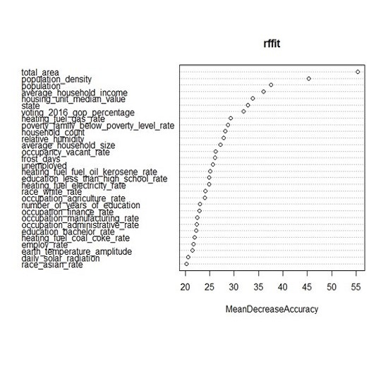

  
  

In this study I looked at the [DeepSolar Database](http://web.stanford.edu/group/deepsolar/home). The DeepSolar database is created from analysed satellite imagery that identifies solar photovoltaic (PV) panels in the United States. Each satellite image is analysed for the number of photovoltaic panels present, and a number of environmental and social factors are measured for the area the group of panels was found in. The solar database used in this analysis is composed of 20736 observations on 81 variables. Each observation signifies a satellite image that DeepSolar has detected as having solar photovoltaic panels present. The response variable in this analysis was the number of solar panels present in each observation, a binary variable taking the two values ‘Low’ and ‘High’. Low indicates that ≤10 solar panels were detected, High indicates that >10 solar panels were detected. The 80 predictor variables range from economic factors such as electricity price, to geographical such as humidity. 

After carrying out exploratory data analysis and cleaning the data - I compared the classification performance of 4 different classifiers - Binomial Logistic Regression, Support Vector Machines, Boosting, and Random Forest. The best model, Random Forest was chosen due to its accuracy on the validation set compared to the other classifiers. This classifier had a classification accuracy of 95.9%. It was found that the most important variables in predicting the prevalence of solar panels was total area, population density, population, and average household income. It is worth noting that I also tested classifier runtime for estimating processing demand. It was found that although Binomial Logistic Regression had a lower classification accuracy value of 87.6%, it had a runtime of 0.52 seconds in comparison to 70.8 seconds for the Random Forest classifier. So if work is being done on older hardware, or performance is a known limiting factor, it may be worth classifying using Logistic Regression instead.

Please feel free to contact me to ask any further information, you can view the [full pdf report of the project here](seanmc64.github.io/solar1) which includes the R code in the appendix

